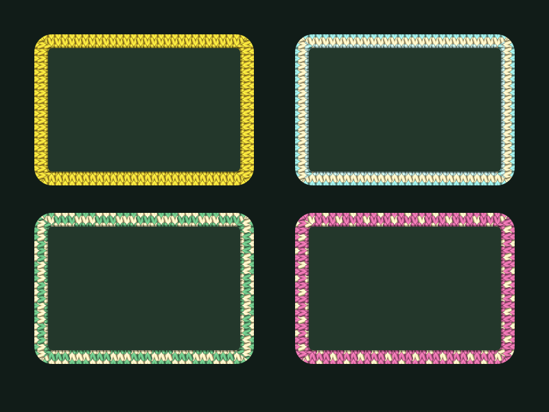

# Omarchy Sweater Kit

Knitted sweaters for your Hyprland windows. An Omarchy shell plugin that wraps
every window in a stockinette border, dyed with your current Omarchy theme and
picked per app from its icon colour. A ball of yarn in the bar toggles it.



## Install

```sh
omarchy plugin add https://github.com/mic-kul/omarchy-sweater-kit.git --enable
```

Or from a local checkout:

```sh
./install.sh --section right
```

Either way you get a `service` that keeps the overlay running and a
`bar-widget` (🧶) that toggles it. Needs `gtk4-layer-shell`, `python-gobject`
and `python-cairo`, all stock on Omarchy.

Control it from a terminal or keybinding too:

```sh
~/.config/omarchy/plugins/mickul.sweater-kit/bin/sweater-kit toggle   # or on / off / status
```

Disable with `omarchy plugin disable mickul.sweater-kit`.

### Without the plugin system

Run `bin/sweater-kit` from anywhere, for example
`o.launch_on_start("/path/to/bin/sweater-kit")` in `~/.config/hypr/autostart.lua`.

## How it works

- One layer-shell surface per monitor on the `top` layer, with an empty input
  region so clicks pass straight through.
- Polls Hyprland's IPC socket 30 times a second for window geometry and
  repaints only when something moved.
- Tiled windows are painted least-recent first, floating windows after, and
  each frame is clipped by the windows above it, so a sweater never bleeds
  over a window on top.
- Fullscreen windows are skipped. Pinned windows show on every workspace.
- `Service.qml` owns the process and restarts it with backoff if it dies.
  `BarWidget.qml` watches `$XDG_RUNTIME_DIR/sweater-kit.state` for on/off.

## Colours

By default the yarn comes from `~/.local/state/omarchy/current/theme/colors.toml`.
Each app's icon is sampled for its dominant hue, then the closest theme colour
is used as its main yarn, with the theme's bright foreground as the accent.
Changing themes with `omarchy theme set ...` re-knits everything within two
seconds.

Each app also gets one of four designs, chosen by its window class:
`solid`, `stripes`, `checker` or `fairisle`.

## Knobs

Copy `sweater-kit.toml.example` to `~/.config/sweater-kit.toml` and edit. Changes
apply live within two seconds, no restart.

| Key         | Default | Meaning                                                        |
|-------------|---------|----------------------------------------------------------------|
| `thickness` | `12`    | Total knit width in px                                         |
| `outset`    | `6`     | How much of it sits outside the window edge; the rest overlaps the window |
| `stitch`    | `12`    | Stitch width in px                                             |
| `yarn`      | `theme` | `theme` dyes to the Omarchy theme, `icon` uses raw icon colours |
| `design`    | `""`    | Force one design for every window                              |
| `poll_ms`   | `33`    | Geometry poll interval                                         |

Every key can also be set as an environment variable, e.g. `SWEATER_THICKNESS=20`.
Environment wins over the file.

With the default `gaps_in = 5` an `outset` above 5 starts to overlap the
neighbouring window's knit. Raise `gaps_in` in `~/.config/hypr/looknfeel.lua`
if you want a big outset.
